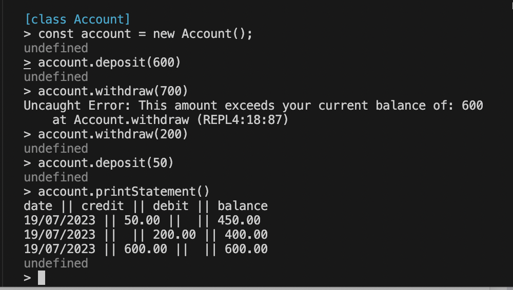

# Bank tech test

## Description
A banking application that allows users to interact with their account to: make deposits, make withdrawals, and see a bank statement with a list of their previous transactions using the Node REPL.

## To Install the program
- Clone the Repo into your local machine.
- Use the command $npm install

## To Use the program
- `cd src`
- `node`
- `.load ./account.js`
- Create a new instance of Account `const account = new Account()`
- Make some transactions eg. `account.withdraw(300)` or `account.deposit(600)`
- See your statement by calling `account.printStatement()`



## To run the tests
- npm test 

## Specification
* You should be able to interact with your code via a REPL like IRB or Node.  (You don't need to implement a command line interface that takes input from STDIN.)
* Deposits, withdrawal.
* Account statement (date, amount, balance) printing.
* Data can be kept in memory (it doesn't need to be stored to a database or anything).

## Acceptance Criteria
**Given** a client makes a deposit of 1000 on 10-01-2023  
**And** a deposit of 2000 on 13-01-2023  
**And** a withdrawal of 500 on 14-01-2023  
**When** she prints her bank statement  
**Then** she would see

```
date || credit || debit || balance
14/01/2023 || || 500.00 || 2500.00
13/01/2023 || 2000.00 || || 3000.00
10/01/2023 || 1000.00 || || 1000.00
```

## Design
I split my program into 2 classes, an Account class to handle transactions/interactions made to the account, and a Statement class which is used to print the record of these transactions in the correct format. Please see user_story.md and class_design_template.md to see my design process.

